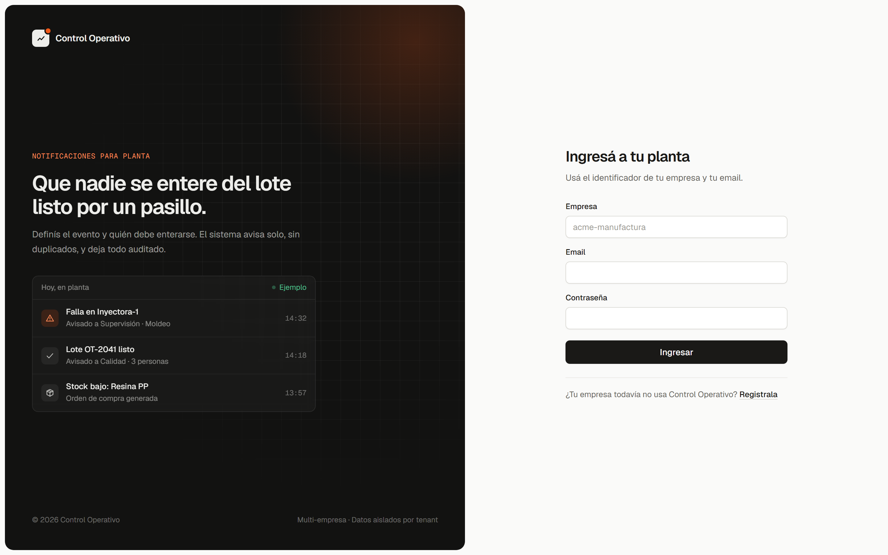
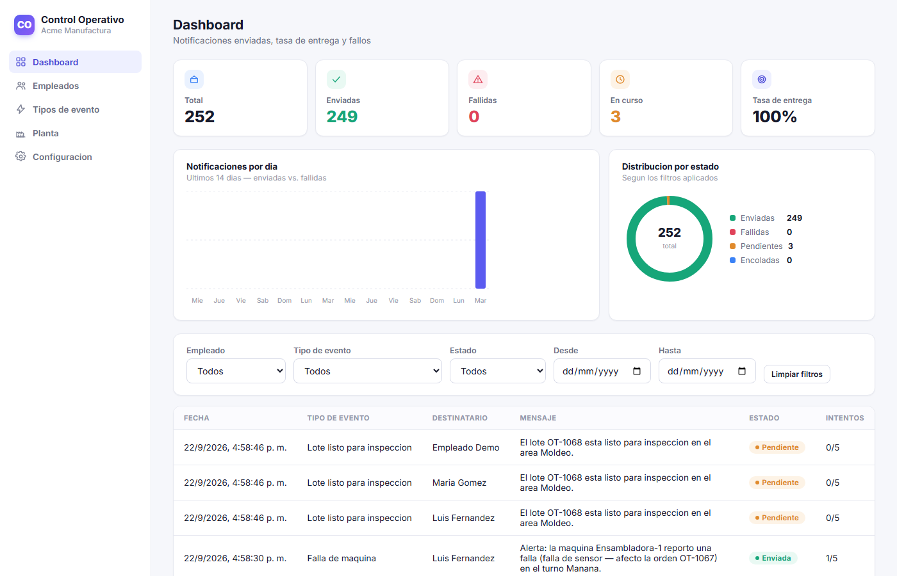
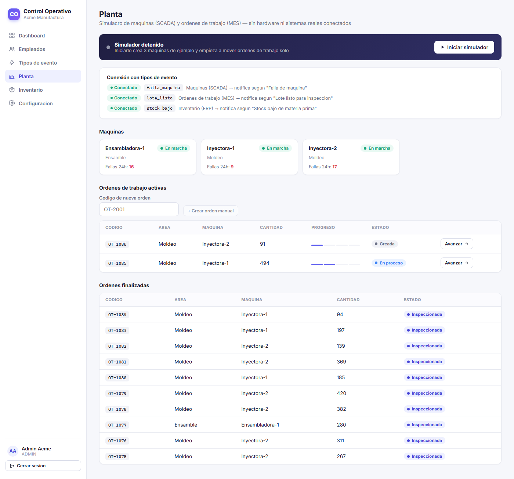

# Control Operativo

**SaaS multi-tenant de notificaciones y seguimiento de procesos para
empresas de manufactura.** Reemplaza el "avisar a mano" del piso de
planta (reportes verbales, WhatsApp suelto, llamadas) por un motor de
eventos configurable que decide solo a quién avisar, entrega en
background sin duplicados, y deja todo auditado.

Generalización de un sistema interno de notificaciones que construí para
una empresa real de manufactura, rehecho como producto multi-tenant que
cualquier empresa puede registrar y configurar por su cuenta — no un fork
por cliente.

> **Estado: MVP completo**, con las 3 fases del proyecto más un módulo
> extra de simulación de planta. Todo probado de punta a punta: backend
> contra una base Postgres real, frontend con un navegador real
> (Playwright), no solo compilado.

## Tabla de contenidos

- [Capturas](#capturas)
- [Qué resuelve](#qué-resuelve)
- [Arquitectura](#arquitectura)
- [Modelo de datos](#modelo-de-datos)
- [Simulacro de planta — SCADA / MES / ERP](#simulacro-de-planta--scada--mes--erp)
- [Cómo levantar el proyecto localmente](#cómo-levantar-el-proyecto-localmente)
- [Endpoints principales](#endpoints-principales)
- [Panel de administración](#panel-de-administración-frontend)
- [Tests](#tests)
- [Roadmap](#roadmap)

## Capturas

| Login | Dashboard |
|---|---|
|  |  |

| Planta (SCADA/MES/ERP simulados) |
|---|
|  |

## Qué resuelve

Cada empresa (tenant) se registra, da de alta a sus empleados, y define
sus propios **tipos de evento**: qué dispara la notificación, quién debe
recibirla (por rol, por área o a todos), y con qué mensaje. Un evento se
puede disparar:

1. **Manualmente** — desde el panel o un `curl`.
2. **Por webhook** — un sistema externo (ERP, MES, un sensor) llama a
   `POST /api/events/trigger` con una API key propia del tenant, sin
   necesitar una cuenta de usuario.
3. **Programado** — con una expresión cron por tipo de evento.

En los tres casos, el mismo motor se encarga de: repartir la
notificación entre los destinatarios que correspondan, **nunca
duplicarla** aunque el disparo se repita, entregarla en background sin
bloquear al que la disparó, reintentar si falla, y dejar todo — creada,
encolada, enviada o fallida — auditado con timestamps.

## Arquitectura

```
control-operativo/
├── backend/    API REST — Node.js + Express + TypeScript + Prisma
│   ├── prisma/         schema, migraciones, seed, hardening RLS opcional
│   ├── src/
│   │   ├── modules/    un folder por feature (auth, users, eventTypes,
│   │   │               events, notifications, machines, workOrders,
│   │   │               inventory, simulator, tenants)
│   │   ├── queue/      worker de entrega + scheduler de cron
│   │   ├── simulator/  generador SCADA/MES/ERP (ver más abajo)
│   │   ├── middleware/ auth JWT/API-key, manejo de errores
│   │   └── db/         cliente Prisma compartido
│   └── tests/          integración contra Postgres real
└── frontend/   Panel de administración — React + Vite + TypeScript
    └── src/
        ├── api/        cliente fetch tipado
        ├── pages/       una página por sección del panel
        ├── components/  layout, gráficos SVG, íconos, etc.
        └── context/     sesión / auth
```

- **Autenticación**: JWT firmado con `{ userId, tenantId, role }`. El
  `tenantId` de cada request SIEMPRE sale del token verificado, nunca de
  parámetros de la URL o del body — así ningún tenant puede leer o
  escribir datos de otro con solo cambiar un id.
- **Aislamiento multi-tenant**: cada función de acceso a datos
  (`src/modules/**/*.service.ts`) recibe `tenantId` de forma explícita y
  lo incluye en el `where` de toda consulta/mutación. Además se incluye
  `backend/prisma/rls.sql` con políticas de Row-Level Security de
  Postgres para todas las tablas con `tenant_id`. **Todavía no está
  activo**: la app aún no fija `app.current_tenant_id` por request, así
  que hoy el aislamiento depende solo de los filtros de la capa de
  servicios (ver en ese archivo qué falta para activarlo).
- **Sesiones**: además de verificar la firma del JWT, cada request relee
  al usuario de la base; un usuario dado de baja (o una empresa
  desactivada) pierde el acceso de inmediato, y un cambio de rol aplica
  sin esperar a que el token expire.
- **Cola de notificaciones**: en vez de sumar Redis/BullMQ desde el día
  uno, el MVP usa la propia tabla `notifications` de Postgres como cola
  (`status = PENDING` + un worker — proceso separado, `npm run worker` —
  que hace polling con `FOR UPDATE SKIP LOCKED`, seguro aunque corran
  varias instancias del worker a la vez). El endpoint que dispara un
  evento (`POST /api/events/trigger`) solo inserta filas y responde de
  inmediato — nunca espera al envío real. El envío está detrás de una
  interfaz de canal (`EMAIL` implementado con `nodemailer`, `WHATSAPP`
  reservado) para poder sumar WhatsApp Cloud API sin tocar el resto del
  sistema, y la cola está igual de abstraída para poder migrar a
  BullMQ+Redis si el volumen lo justifica. Reintentos con backoff
  exponencial (30s, 1min, 2min... tope 30min) hasta `max_attempts` (5 por
  defecto), todo auditado en `notification_logs`.
- **Anti-duplicación**: cada disparo de evento crea una fila en `events`
  con `UNIQUE(tenant_id, idempotency_key)`. Si el mismo evento se dispara
  dos veces (ej. un webhook reintentado), la segunda inserción falla por
  la restricción única y el sistema devuelve el evento ya existente en
  vez de volver a generar notificaciones — el fan-out a destinatarios
  ocurre una sola vez por evento, sin importar a cuántas personas les
  toque recibirlo. Probado en `backend/tests/idempotency.test.ts`.
- **Disparo manual, webhook y programado**: `POST /api/events/trigger`
  acepta tanto un JWT de usuario logueado como un header `X-API-Key`
  (credencial por tenant). Un `event_type` puede además tener un
  `schedule` (expresión cron); el API registra esos disparos
  automáticamente (`src/queue/scheduler.ts`) usando la misma ruta de
  anti-duplicación (la idempotency key se deriva del minuto exacto del
  tick), así que un reinicio o una segunda instancia del scheduler nunca
  duplica el disparo.
- **Frontend**: React + Vite + TypeScript, CSS plano (sin Tailwind/MUI ni
  otra librería de diseño), `react-router-dom` para las rutas y `fetch`
  directo contra el API (sin capa de estado extra tipo Redux/React Query
  — el MVP no la necesita). Los gráficos del dashboard (donut + barras)
  son SVG hecho a mano, sin librería de charts. El rol del usuario
  logueado decide qué ve: `ADMIN`/`SUPERVISOR` llegan al dashboard con
  historial completo; `EMPLEADO` llega directo a "Mis notificaciones" (su
  propio historial) y no ve las secciones de gestión.

## Modelo de datos

Ver el esquema completo y comentado en
[`backend/prisma/schema.prisma`](backend/prisma/schema.prisma). Resumen:

| Tabla | Propósito |
|---|---|
| `tenants` | Empresa cliente del SaaS. Incluye `api_key` para disparar eventos por webhook sin usuario. |
| `users` | Personas de un tenant: pueden loguear (admin/supervisor) o ser solo destinatarias de notificaciones (empleado de planta, `password_hash` nulo). |
| `event_types` | Catálogo configurable por tenant: nombre, `trigger_key`, regla de destinatarios (`recipient_rule` JSON: por rol, por área o por lista de usuarios), plantilla de mensaje, canal. |
| `events` | Una ocurrencia real de un evento disparado. Aquí vive la deduplicación (`UNIQUE(tenant_id, idempotency_key)`). |
| `notifications` | Fan-out por destinatario de un `event`. Es la unidad que procesa el worker y la que alimenta el dashboard. |
| `notification_logs` | Log inmutable de cada cambio de estado de una notificación (creada → encolada → enviada/fallida), con timestamps. |
| `machines` | Simulacro SCADA/PLC: una máquina de planta con estado en vivo (`RUNNING`/`IDLE`/`DOWN`/`MAINTENANCE`). |
| `machine_status_logs` | Log inmutable de cambios de estado de una máquina — de acá sale el conteo de fallas. |
| `work_orders` | Simulacro MES: una orden de trabajo con ciclo de vida `CREATED → IN_PROGRESS → READY → INSPECTED`. |
| `inventory_items` | Simulacro ERP (inventario): materia prima que el MES consume al arrancar una orden. |
| `purchase_orders` | Simulacro ERP (compras): reposición generada sola cuando un insumo cae debajo de su umbral. |

**Decisión de diseño** respecto al modelo sugerido en el brief original:
se separó `events` de `notifications` (el brief tenía `idempotency_key`
directo en `notifications`). La razón: un solo evento puede repartirse
entre varios destinatarios (ej. "avisar a todos los supervisores del
área"), y si la clave de idempotencia estuviera en `notifications` no
podría ser única por sí sola sin impedir ese fan-out. Con `events` como
punto único de deduplicación, el fan-out a N destinatarios queda
protegido con una sola restricción única.

> **Nota sobre zonas horarias**: todas las columnas de fecha usan
> `TIMESTAMPTZ` (no `TIMESTAMP` sin zona) a propósito. Se detectó durante
> el desarrollo que un Postgres con `TimeZone` del servidor distinto de
> UTC (ej. `Etc/GMT+12`) hace que comparar un `timestamp` "naive" contra
> `now()` en el worker de la cola quede desfasado por horas — las
> notificaciones quedarían en `PENDING` para siempre sin ningún error
> visible. Con `TIMESTAMPTZ` la comparación es correcta sin importar la
> zona horaria configurada en el servidor o en la sesión del cliente.

## Simulacro de planta — SCADA / MES / ERP

Para que el sistema se sienta conectado a un piso de planta real sin
necesitar hardware, el panel incluye dos secciones — **Planta** (`/plant`)
e **Inventario** (`/inventory`) — que simulan, en memoria, las tres capas
mas cercanas a Control Operativo en una arquitectura de manufactura real:

| Capa real | En este sistema | Tabla |
|---|---|---|
| **SCADA/PLC** — controla máquinas, lee sensores | Máquinas con estado en vivo (`RUNNING`/`IDLE`/`DOWN`/`MAINTENANCE`) | `machines`, `machine_status_logs` |
| **MES** — órdenes de trabajo, trazabilidad de lotes | Órdenes de trabajo con ciclo de vida `CREATED → IN_PROGRESS → READY → INSPECTED` | `work_orders` |
| **ERP** — inventario, compras | Materia prima que el MES consume, con reposición automática de stock | `inventory_items`, `purchase_orders` |

Un botón **"Iniciar simulador"** en `/plant` (solo admin) arranca un
generador (`backend/src/simulator/simulator.ts`) que corre en el proceso
del API: crea 3 máquinas y 3 insumos de ejemplo si el tenant no tiene
ninguno, y cada pocos segundos:

- mueve máquinas entre estados (una máquina en marcha puede fallar; una
  con falla se puede recuperar),
- crea y avanza órdenes de trabajo, asignándolas a una máquina en
  marcha,
- al arrancar una orden (`IN_PROGRESS`), **consume materia prima** de un
  insumo al azar (nunca baja de 0 — el consumo se recorta al stock
  disponible) — si el stock cae debajo de su umbral de reposición, se
  genera sola una orden de compra (`purchase_orders`), visible y
  recibible desde `/inventory`.

`/plant` muestra máquinas y órdenes de trabajo (SCADA + MES); `/inventory`
muestra materia prima y compras (ERP) — separadas en dos secciones del
menú para que cada una se pueda revisar sin scrollear una página larga.
Sin ningún timer en el frontend: todo el estado vive en el backend, cada
página hace polling cada 5s para mostrarlo.

**Lo importante — el simulador no tiene un camino especial de
notificación.** Cuando una máquina se cae, llama a
`triggerEvent(tenantId, { triggerKey: "falla_maquina", ... })` — la
misma función que usa el endpoint HTTP `/api/events/trigger`. Cuando una
orden llega a `READY`, dispara `lote_listo`. Cuando el stock de un
insumo cae, dispara `stock_bajo`. Los tres pasan por el mismo motor, con
la misma anti-duplicación y el mismo worker de entrega que un webhook
real. Esto demuestra el punto central del sistema: no importa si el
evento viene de un click en el panel, un webhook externo, un cron, o (como
acá) un simulacro de SCADA/MES/ERP — todo entra por la misma puerta.

**Planta ↔ Tipos de evento ↔ Dashboard, conectados de forma explícita**:
- Una falla de máquina que ocurre mientras hay una orden `IN_PROGRESS`
  corriendo en ella queda mencionada en el propio mensaje de la
  notificación ("...reportó una falla (sobrecalentamiento — afecto la
  orden OT-1052)...") — antes la falla y la orden afectada no tenían
  ninguna relación en el sistema.
- La página **Planta** muestra un panel de estado que cruza los tres
  `trigger_key` que usa el simulador (`falla_maquina`, `lote_listo`,
  `stock_bajo`) contra los `event_types` configurados del tenant: si a
  alguno le falta el tipo de evento (o está inactivo), lo marca
  "Sin configurar" con un link directo a `/event-types` — así queda claro
  quién de estos tres NO va a notificar a nadie en vez de fallar en
  silencio.
- La página **Tipos de evento** marca con una etiqueta "Planta" los
  `trigger_key` que coinciden con los que usa el simulador, y el botón
  "Probar disparo" les manda un payload de ejemplo realista (antes
  mandaba `{}` vacío y el mensaje quedaba con variables `{{...}}` sin
  reemplazar).
- El Dashboard no filtra por origen: una notificación generada por el
  simulador se ve exactamente igual que una manual o de webhook, en la
  misma tabla, mismos gráficos, mismas stats.

**Limitaciones a propósito** (es un simulacro, no una integración real):
- El estado del simulador vive en memoria del proceso del API — si se
  reinicia, hay que volver a apretar "Iniciar simulador".
- No habla ningún protocolo industrial real (OPC-UA, Modbus, MQTT); los
  "sensores" son un `Math.random()` con probabilidades ajustadas para que
  se vea razonable en una demo.
- No calcula OEE real, solo un contador simple de fallas en las últimas
  24h por máquina.
- El ERP simulado es solo inventario/compras — no incluye finanzas ni
  RRHH, que no tienen un tie-in natural con un sistema de notificaciones.

## Cómo levantar el proyecto localmente

### Requisitos

- Node.js 20+
- PostgreSQL 14+ corriendo localmente (o accesible por `DATABASE_URL`)

### Backend

```bash
cd backend
cp .env.example .env      # ajustar DATABASE_URL si hace falta
npm install
npm run prisma:migrate    # crea las tablas
npm run seed               # carga datos de ejemplo (ver abajo)
npm run dev                 # API en http://localhost:4000
```

En **otra terminal**, el worker que entrega las notificaciones (proceso
separado a propósito: el API nunca bloquea un request esperando un envío
real):

```bash
cd backend
npm run worker
```

Sin el worker corriendo, los eventos se disparan y las notificaciones se
crean igual, pero quedan en `PENDING` hasta que el worker las procese.

### Frontend

En una **tercera terminal**:

```bash
cd frontend
cp .env.example .env   # VITE_API_URL, por defecto http://localhost:4000
npm install
npm run dev             # panel en http://localhost:5173
```

Con el seed cargado, entrar en `http://localhost:5173` (redirige a
`/login`) con empresa `acme-manufactura`, email `admin@acme.local`,
contraseña `admin1234`.

### Variables de entorno (`backend/.env`)

| Variable | Descripción |
|---|---|
| `DATABASE_URL` | Cadena de conexión a Postgres. |
| `JWT_SECRET` | Secreto para firmar los tokens. Cambiar en producción. |
| `JWT_EXPIRES_IN` | Vigencia del token (default `8h`). |
| `PORT` | Puerto del API (default `4000`). |
| `SMTP_HOST`, `SMTP_PORT`, `SMTP_USER`, `SMTP_PASS`, `SMTP_FROM` | Credenciales SMTP para el canal email. Si se dejan vacías, el envío se registra igual en la base pero se imprime en consola en vez de salir por SMTP real — así el MVP corre sin credenciales de correo. |
| `WORKER_POLL_INTERVAL_MS` | Cada cuánto revisa el worker la cola de notificaciones pendientes (ms, default `2000`). |

Frontend (`frontend/.env`): `VITE_API_URL` — URL base del backend
(default `http://localhost:4000`).

### Seed de ejemplo

`npm run seed` crea:

- 1 tenant: **Acme Manufactura** (slug `acme-manufactura`)
- 1 admin para loguear: `admin@acme.local` / `admin1234`
- 3 empleados: un supervisor de área Moldeo y dos operadores (Moldeo y
  Ensamble)
- 3 tipos de evento: `lote_listo` (avisa al área Moldeo), `falla_maquina`
  (avisa a los supervisores) y `stock_bajo` (avisa al admin — usado por
  el simulacro ERP)

Las máquinas e insumos del simulacro de planta **no** vienen en el seed
— se crean solos la primera vez que se aprieta "Iniciar simulador" en
`/plant`.

### Probar la API

```bash
# Login
curl -X POST http://localhost:4000/api/auth/login \
  -H "Content-Type: application/json" \
  -d '{"tenantSlug":"acme-manufactura","email":"admin@acme.local","password":"admin1234"}'

# Registrar una empresa nueva (multi-tenant real, no solo el seed)
curl -X POST http://localhost:4000/api/tenants/register \
  -H "Content-Type: application/json" \
  -d '{"companyName":"Otra Manufactura","adminName":"Ana","adminEmail":"ana@otra.test","adminPassword":"password123"}'

# Listar empleados (usar el token devuelto por login)
curl http://localhost:4000/api/users -H "Authorization: Bearer <token>"

# Crear un tipo de evento (admin)
curl -X POST http://localhost:4000/api/event-types \
  -H "Authorization: Bearer <token>" -H "Content-Type: application/json" \
  -d '{
    "name": "Lote listo",
    "triggerKey": "lote_listo",
    "recipientRule": {"type":"AREA","value":"Moldeo"},
    "messageTemplate": "El lote {{lote_id}} esta listo en {{area}}."
  }'

# Disparar un evento (con JWT, o con X-API-Key del tenant en vez del header Authorization)
curl -X POST http://localhost:4000/api/events/trigger \
  -H "Authorization: Bearer <token>" -H "Content-Type: application/json" \
  -d '{"triggerKey":"lote_listo","idempotencyKey":"lote-102","payload":{"lote_id":"L-102"}}'

# Ver historial de notificaciones (filtros: recipientUserId, eventTypeId, status, from, to)
curl "http://localhost:4000/api/notifications?status=SENT" -H "Authorization: Bearer <token>"

# Tasa de entrega
curl http://localhost:4000/api/notifications/stats -H "Authorization: Bearer <token>"

# Iniciar el simulacro de planta (crea maquinas/insumos y empieza a generar eventos solo)
curl -X POST http://localhost:4000/api/simulator/start -H "Authorization: Bearer <token>"
```

## Endpoints principales

| Método y ruta | Rol | Descripción |
|---|---|---|
| `POST /api/tenants/register` | público | Alta de empresa + usuario admin |
| `POST /api/auth/login` | público | `{ tenantSlug, email, password }` |
| `GET /api/auth/me` | autenticado | Usuario actual |
| `GET/POST/PATCH/DELETE /api/users` | admin/supervisor | Alta, baja (lógica) y edición de empleados. Un supervisor solo gestiona usuarios `EMPLEADO`; asignar roles es solo del admin |
| `GET /api/tenant` | admin | Datos de la empresa (incluye `api_key`) |
| `POST /api/tenant/api-key/rotate` | admin | Rota la `api_key` de webhook |
| `GET/POST/PATCH/DELETE /api/event-types` | admin (GET: +supervisor) | Catálogo de tipos de evento |
| `POST /api/events/trigger` | admin/supervisor **o** `X-API-Key` | Dispara un evento (`triggerKey`, `idempotencyKey`, `payload`) |
| `GET /api/notifications` | admin/supervisor | Historial filtrable (paginado) |
| `GET /api/notifications/mine` | autenticado | Historial propio del usuario logueado |
| `GET /api/notifications/stats` | admin/supervisor | Totales, tasa de entrega y tendencia diaria (14 días) |
| `GET /api/notifications/:id` | admin/supervisor | Detalle + log de auditoría de una notificación |
| `GET/POST /api/machines`, `PATCH /api/machines/:id/status` | admin (GET: +supervisor) | Simulacro SCADA: máquinas y su estado |
| `GET/POST /api/work-orders`, `POST /api/work-orders/:id/advance` | admin/supervisor | Simulacro MES: órdenes de trabajo y su ciclo de vida |
| `GET/POST /api/inventory` | admin (GET: +supervisor) | Simulacro ERP: insumos e inventario |
| `GET /api/purchase-orders`, `POST /api/purchase-orders/:id/receive` | admin/supervisor | Simulacro ERP: órdenes de compra |
| `GET/POST /api/simulator/status`, `/start`, `/stop` | admin (GET: +supervisor) | Prender/apagar el generador automático de eventos de planta |

## Panel de administración (frontend)

| Página | Rol | Qué hace |
|---|---|---|
| `/login`, `/register` | público | Login por empresa+email+password, alta de nueva empresa |
| `/` (Dashboard) | admin/supervisor | Stat cards, gráfico de tendencia (14 días) y donut por estado, historial filtrable por empleado/tipo de evento/estado/fecha, paginado |
| `/` (Mis notificaciones) | empleado | Su propio historial de notificaciones recibidas |
| `/employees` | admin/supervisor | Alta, edición y baja lógica de empleados (email, rol, área, turno, canal de contacto) |
| `/event-types` | admin/supervisor | Catálogo de tipos de evento: constructor de regla de destinatarios (rol/área/todos), plantilla, canal, cron opcional, botón "Probar disparo" (con payload de ejemplo), y una etiqueta "Planta" en los trigger_key que usa el simulador |
| `/plant` | admin/supervisor | Simulacro SCADA/MES: máquinas, órdenes de trabajo, y un panel que muestra si cada evento de planta está conectado a un tipo de evento activo (ver arriba) |
| `/inventory` | admin/supervisor | Simulacro ERP: materia prima y órdenes de compra, con botón para marcarlas recibidas |
| `/settings` | admin | Nombre/slug de la empresa, ver y rotar la `api_key` de webhook |

## Tests

```bash
cd backend
npm test
```

Requiere una base Postgres accesible por `DATABASE_URL` con las
migraciones aplicadas (`npm run prisma:migrate`). Incluye:

- `tests/tenant-isolation.test.ts` — un tenant no puede leer ni modificar
  empleados de otro tenant aunque tenga un JWT válido.
- `tests/idempotency.test.ts` — disparar el mismo evento dos veces con la
  misma `idempotencyKey` genera un solo `Event` y una sola `Notification`
  por destinatario; con `idempotencyKey` distinta sí se generan eventos
  separados.

## Roadmap

1. ✅ Modelo de datos + autenticación multi-tenant + gestión de empleados.
2. ✅ Motor de eventos configurables (manual, webhook y programado) + cola
   asíncrona con reintentos + anti-duplicación + canal de email + auditoría.
3. ✅ Panel de administración (React + Vite): dashboard con gráficos,
   tasa de entrega y filtros, gestión de empleados y de tipos de evento,
   configuración de API key.
4. ✅ Bonus: simulacro de planta — SCADA (máquinas), MES (órdenes de
   trabajo) y ERP (inventario/compras) generados automáticamente y
   conectados al mismo motor de eventos. Ver
   [Simulacro de planta](#simulacro-de-planta--scada--mes--erp).
5. Futuro (no en este MVP): canal WhatsApp Cloud API real, invitación de
   usuarios por email, rol de servicio granular para API keys, edición de
   destinatarios por lista puntual de usuarios (`recipientRule` tipo
   `USERS`) desde el panel — hoy solo se puede crear vía API, integración
   real con protocolos industriales (OPC-UA/Modbus/MQTT) en vez del
   simulacro, módulos ERP de finanzas/RRHH.
